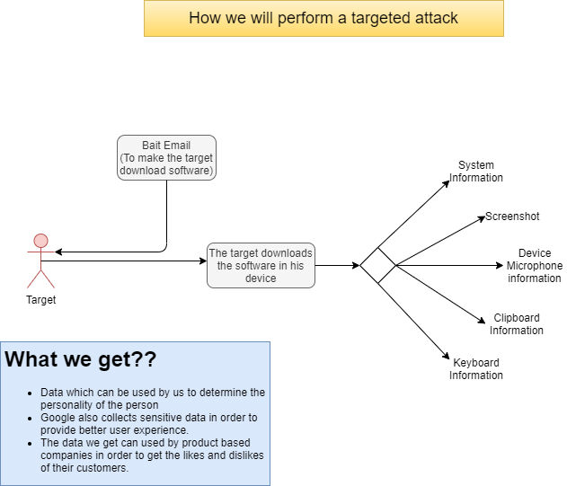
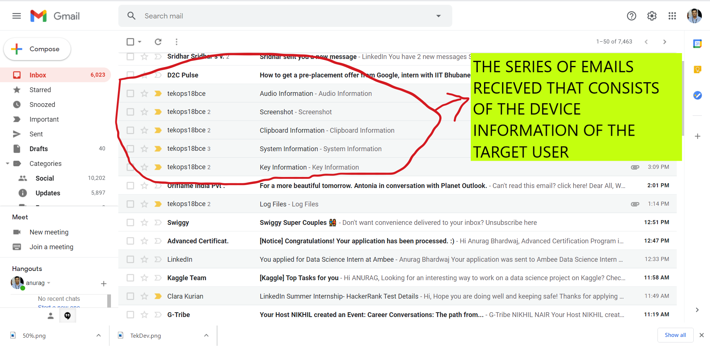

# Key-Logger-for-Targeted-Attacks

## Abstract
Keystroke logging, often referred to as keylogging or keyboard capturing, is the action of
recording (logging) the keys struck on a keyboard, typically covertly, so that person using the
keyboard is unaware that their actions are being monitored. Data can then be retrieved by the
person operating the logging program. A keystroke recorder or keylogger can be
either software or hardware..A key-logger is a tool that hackers use to monitor and record the
keystrokes you make on your keyboard. Whether they’re installed on your operating system or
embedded into the hardware, some key- loggers can be very difficult to detect.

## Planning of Targetted Attack

## Sample Bait Email

  

## Email Recieved by Keylogger-Owner

